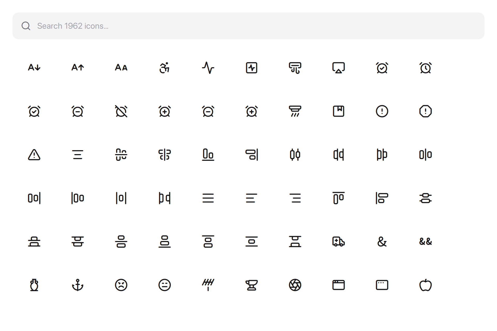

# lucide-qtquick

**English** | [简体中文](README.zh-CN.md)

[](LICENSE)


A [Lucide](https://lucide.dev) icon module for Qt Quick / QML, meant to be consumed
from source in other Qt projects.

<p align="center">
  
</p>

The bundled **icon browser** example (`examples/icon-browser`) is a single-file
`Main.qml`: a search box on top and a `GridView` of every icon below (hover a tile to
see its name). The grid model is a generated data table, so the search matches names,
labels, class names and codepoints. Build it standalone with
`-DLUCIDE_QTQUICK_BUILD_EXAMPLES=ON`.

## Requirements

- CMake 3.21+
- Qt 6.5+
- C++17

## Integration

Drop the repository into your project and pull it in with `add_subdirectory(...)`:

```cmake
find_package(Qt6 6.5 REQUIRED COMPONENTS Quick Qml)

qt_standard_project_setup()

set(LUCIDE_QTQUICK_BUILD_EXAMPLES OFF CACHE BOOL "" FORCE)
add_subdirectory(third_party/lucide-qtquick)

qt_add_executable(MyApp
    main.cpp
)

qt_add_qml_module(MyApp
    URI MyApp
    VERSION 1.0
    QML_FILES
        Main.qml
)

target_link_libraries(MyApp
    PRIVATE
        Qt6::Quick
        LucideIcons
        LucideIconsplugin
)
```

## Usage

```qml
import QtQuick
import LucideIcons 1.0

Rectangle {
    width: 120
    height: 120
    color: "white"

    LucideIcon {
        anchors.centerIn: parent
        name: "search"
        size: 28
        color: "#0071e3"
    }
}
```

You can also use the `Lucide` singleton:

- `Lucide.glyph(name)`
- `Lucide.hasGlyph(name)`
- `Lucide.iconNames()`
- `Lucide.family`
- `Lucide.iconsVersion` — the bundled Lucide release (e.g. `"1.8.0"`)

## Icon set

Icons are bundled from **Lucide 1.8.0** (1695 icons; 1962 glyphs including aliases).
Provenance is recorded in [`third_party/lucide-font/source.json`](third_party/lucide-font/source.json).

## Notes

This repository is intended for source-based integration; it is not published as an
installable package.

## License

This module is released under the [MIT License](LICENSE). The icon glyphs are from
[Lucide](https://lucide.dev), licensed under ISC.
